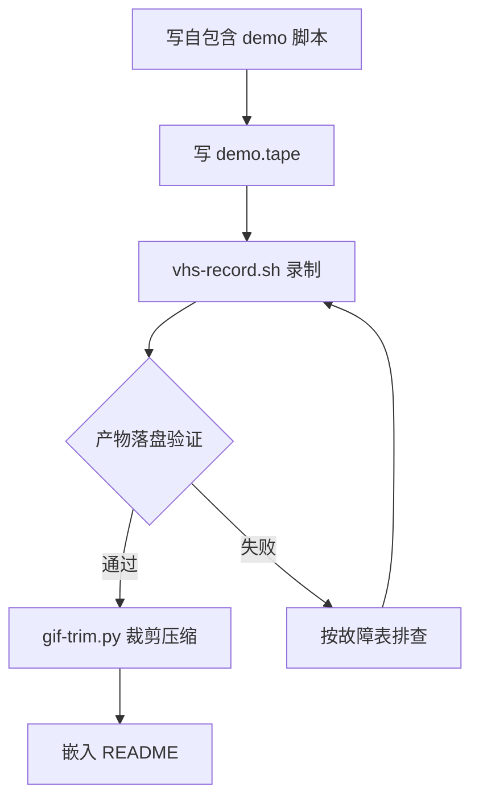

# 程序演示 GIF 录制（VHS 管线）

把「跑一个命令、看一段输出」的程序行为录制成可嵌入 README 的 GIF。管线三段：**自包含演示命令 → VHS 声明式录制 → 自动裁剪压缩**。全部坑点已标注，照做即可一次成功。

## 适用场景

- CLI 工具 / Web 应用想放一张"运行起来什么样"的动图到 README
- 任何「终端操作 + 滚动输出」的演示素材制作
- 参考产出：960x600、21 秒、2.05MB、四段功能演示（单命令自包含）

## 管线总览



## 前置依赖（一次性安装）

```bash
export DEBIAN_FRONTEND=noninteractive
apt-get install -y ffmpeg ttyd gifsicle fonts-noto-cjk fonts-noto-color-emoji fonts-jetbrains-mono

# VHS（github release 单二进制）
curl -sL -o /usr/local/bin/vhs https://github.com/charmbracelet/vhs/releases/latest/download/vhs_Linux_x86_64.tar.gz
# 若是 tar 包则解压取二进制；验证：vhs --version

# root 环境必须：chromium wrapper 加 --no-sandbox，否则 chromedp 启动失败
printf '#!/bin/sh\nexec /usr/bin/chromium --no-sandbox "$@"\n' > /usr/local/bin/chromium
chmod +x /usr/local/bin/chromium

# 字体验证（三项都要命中，缺字体=CJK 或 emoji 渲染成方块）
fc-match "JetBrains Mono"
fc-match "Noto Sans CJK SC"
fc-match "Noto Color Emoji"
```

## 第 1 步：写自包含演示脚本

GIF 里只该出现一条命令。把"起服务→演示→停服务"全塞进一个脚本，让 `npm run demo`（或 `./demo.sh`）自己管生命周期：

- **独立端口 + 独立数据目录**（如 `.demo-data/`，加进 .gitignore），绝不碰真实数据
- 脚本结尾 `process.exit(0)`（node）确保子进程（起的服务）被一并收掉
- 输出做**打字机节奏**（每行 30-80ms 间隔）：既是观感需要，也给渲染器留喘息
- 想展示的功能若依赖外部服务（LLM 内核等），用应用自带的 mock/演示模式走真实链路，README 注明"演示模式实录"
- 时长控制 15~30 秒最好；每段功能 4~6 秒

## 第 2 步：写 tape（规则即坑点清单）

```text
Output docs/demo.gif
Set Shell bash
Set Width 960
Set Height 600
Set FontSize 15
Set Theme "Catppuccin Mocha"
Type "PS1='$ '"
Enter
Sleep 500ms
Type "npm run demo"
Enter
Sleep 70s
```

**必须遵守的规则**：

| 规则 | 原因 |
|---|---|
| tape 文件全 ASCII（注释也别写中文） | CJK 字符曾引发命令解析错乱，bash 停在 PS2 续行符，命令根本没执行 |
| `Output` 用相对路径 | 绝对路径 parser 直接报错；**路径相对 vhs 调用时的 CWD**（不是 tape 所在目录），务必在项目根目录调 vhs |
| 提示符美化用 `Type "PS1='$ '"` | vhs 0.10 无 `Set Prompt` 命令；ttyd 的 bash 是 `--noprofile --norc`，默认提示符很丑 |
| `Set Framerate` 无效，别信 | 实测输出恒为 40ms/帧（25fps）；时长估算用 帧数 × 40ms，别按设定帧率算 |
| `Sleep` 给足（演示时长 × 2.5 + 20s） | 低内存环境进程启动可能慢 5~20 倍；录不满可裁，录不够得重录 |
| 分辨率 ≤ 960x600 | 再大 chromium 渲染内存吃紧（见故障表第 1 条） |

vhs 0.10 可用的 Set：`Shell / FontSize / FontFamily / Width / Height / LetterSpacing / LineHeight / TypingSpeed / Theme / Padding / Framerate(无效) / PlaybackSpeed / WaitTimeout / WaitPattern`。

## 第 3 步：录制（用 wrapper 脚本）

```bash
./scripts/vhs-record.sh docs/demo.tape
```

wrapper 做三件事：**录前检查可用内存并警告、`timeout 420` 包装、exit 124 不当失败**（vhs 渲染完成后可能在清理阶段永久挂住，GIF 在挂住前已完整落盘——这是本管线最重要的兜底）。

**录完必须验证演示真的跑完了**：看演示脚本的落盘产物（数据库文件、导出文件、任务清单等）。终端产物（GIF 帧数、文件大小）只能证明"录了"，不能证明"演完了"。

## 第 4 步：裁剪压缩

```bash
python3 scripts/gif-trim.py docs/demo.gif docs/demo-final.gif
```

原理：逐帧采样"非背景像素占比"（ink ratio）定位内容起止帧，保留头部 1.5s 命令行画面 + 尾部 2s 定格，`gifsicle '#起-#止'` 提取后 `-O3 --lossy=80` 压缩。

**GIF 后处理红线**（都用血泪验证过）：

| 禁止 | 后果 |
|---|---|
| `gifsicle -U` | 全量展开所有帧，几百帧 960x600 直接 OOM |
| Pillow 重新保存 GIF | 静默合并相邻帧且打乱帧延迟，时序错乱 |
| 手算时长按设定帧率 | Framerate 无效，按 25fps 算 |

正常现象：`-O3` 后帧数变少（重复帧合并、延迟求和），**总时长不变**即正确。

## 故障排查表（症状 → 根因 → 解决）

| # | 症状 | 根因 | 解决 |
|---|---|---|---|
| 1 | 演示进程中途冻结、tee 日志停止增长、GIF 0 字节、vhs 挂死不退出 | **内存不足**：chromium 渲染停摆 → 无人读 pty → pty 缓冲写满 → 演示进程 stdout 阻塞。低内存云环境常见"内存气球"（free 显示大量已用但无进程归属） | 录前杀掉一切可杀的后台服务；分辨率降到 800x500 试探；`timeout` 包装强制收尾 |
| 2 | `tee` 日志 0 字节但演示产物正常 | 同上（管道版）：tee 写 pty 阻塞反压 | 同上 |
| 3 | vhs exit 124 但 GIF 完整 | 清理阶段永久挂住（ttyd 会话不退出） | 不是失败，正常取文件即可；顺手 `kill` 孤儿 ttyd |
| 4 | 屏幕停在 `>` 续行符，命令没执行 | tape 含 CJK 字符解析错乱 | tape 全 ASCII 重写 |
| 5 | chromium 起不来 / chromedp 报错 | root 下缺 `--no-sandbox` | 装 `/usr/local/bin/chromium` wrapper（见前置依赖） |
| 6 | CJK / emoji 显示为方块 | 字体缺失 | 装 Noto CJK + Noto Color Emoji，`fc-match` 验证 |
| 7 | 演示在普通 shell 正常、录制里挂 | 别急着怀疑代码：99% 是环境（内存/字体/CWD） | 用分层探针定位：tape 里依次 `touch /tmp/marker` → `npm --version` → `命令 > /tmp/log 2>&1`，看卡在哪层 |
| 8 | GIF 前半段长时间空白 | 低内存下 node/npm 启动慢 5~20 倍 | 直跑 `node xx.js` 绕过 npm 层；裁剪掉空白头 |
| 9 | 找不到 GIF 输出文件 | Output 相对的是 vhs 调用 CWD | 在项目根调 vhs，输出写 `docs/xxx.gif` 相对路径 |

## 诊断方法学（复用套路）

- **产物时间线还原法**：对演示的落盘产物 `find -printf` 按时间排序，精确还原"跑到哪一步冻住"，比看日志更快
- **分层探针法**：marker 文件 → 版本号命令 → 纯重定向命令 → 完整命令，逐层收窄
- **内存元凶排查**：`free -m` 用量大但 `ps aux --sort=-rss` 前几名加起来对不上 = 内存气球（virtio-balloon，内核级无进程归属），只能省着用，杀进程省不出多少

## 与「视频转 GIF」管线的取舍

已有 mp4 视频时直接转（两遍调色板法）：

```bash
ffmpeg -i in.mp4 -vf "fps=12,scale=960:-1:flags=lanczos,palettegen=stats_mode=diff" -y palette.png
ffmpeg -i in.mp4 -i palette.png -lavfi "fps=12,scale=960:-1:flags=lanczos [x]; [x][1:v] paletteuse=dither=bayer:bayer_scale=4" -y out.gif
gifsicle -O3 --lossy=80 out.gif -o final.gif
```

对比：VHS 直出画质更佳（无损像素源）；mp4 转换通用性强（任何来源视频）。同素材实测 2.05MB vs 3.2MB。需要配音、字幕、变速的完整宣传视频走 `video-publish` 技能。
