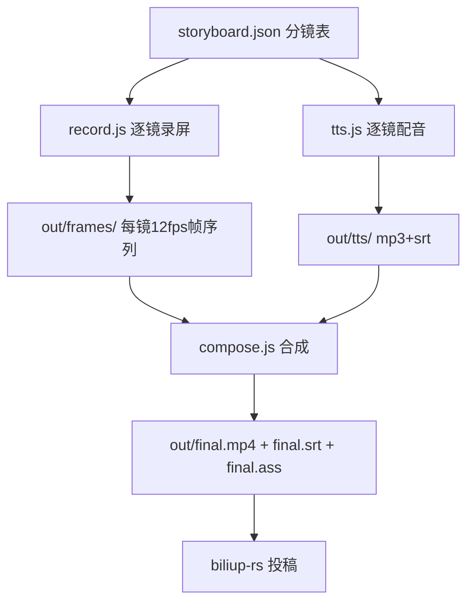

# 软件宣传视频制作 + B站发布 完整流程

为 Node.js Web 项目制作「真实录屏 + AI 中文配音 + 自动合成」的宣传视频，并发布到 B 站。全流程可由 Agent 全自动完成，唯一需要用户参与的环节是 B 站扫码登录（和投稿后的 AI 声明勾选）。

## 适用场景

- 为软件项目制作功能演示视频并发布 B 站
- 任何「网页应用操作录屏 → 配音 → 合成 → 投稿」的流水线需求
- 本 skill 附带完整可运行管线脚本：`scripts/`（record.js / tts.js / compose.js / build.sh / bili_login.mjs / fontconfig.conf）与示例 `scripts/storyboard.json`。制作新视频时把 `scripts/` 复制到目标项目（如 `video/` 目录）作为起点改造

## 前置依赖（一次性安装）

```bash
# 录屏浏览器（playwright + 无头 chromium）
npm install -g playwright && playwright install chromium-headless-shell
# chromium 系统依赖（Debian；apt 官方源失效时换镜像源）
export DEBIAN_FRONTEND=noninteractive
apt-get install -y libglib2.0-0 libnss3 libnspr4 libatk1.0-0 libatk-bridge2.0-0 libcups2 libdrm2 libxkbcommon0 libxcomposite1 libxdamage1 libxfixes3 libxrandr2 libgbm1 libasound2 libpango-1.0-0 libcairo2 fonts-noto-cjk fontconfig qrencode

# 视频合成（ffmpeg-static 无 drawtext 滤镜，靠 libass 烧字幕；路径全局固定）
npm install -g ffmpeg-static ffprobe-static
# 二进制位置：/usr/local/lib/node_modules/ffmpeg-static/ffmpeg 与 /usr/local/lib/node_modules/ffprobe-static/bin/linux/x64/ffprobe

# 中文 TTS 配音
pip3 install --break-system-packages edge-tts

# B站投稿工具（Rust 静态二进制）
curl -sL -o /tmp/opencode/biliup.tar.xz https://github.com/biliup/biliup-rs/releases/download/v0.2.4/biliupR-v0.2.4-x86_64-linux.tar.xz
tar xf /tmp/opencode/biliup.tar.xz -C /tmp/opencode
# 可执行文件：/tmp/opencode/biliupR-v0.2.4-x86_64-linux/biliup
```

注意：ffmpeg-static 的 libass 依赖 fontconfig 配置。若 `Fontconfig error` 导致字幕渲染空白，需安装 fontconfig 包；项目已自带最小配置 `scripts/assets/fontconfig.conf`，compose.js 会自动设置 `FONTCONFIG_FILE` 指向它。

## 管线总览



## 第1步：分镜表 storyboard.json

结构：`meta`（分辨率、录屏端口）+ `shots[]`。每个分镜：

```json
{
  "id": "s3",                    // 帧目录名 out/frames/s3
  "title": "AI对话建图",
  "minSec": 14,                  // 最短时长；成片段长 = max(配音时长+1, minSec)
  "timeoutMs": 480000,           // 该镜总超时（AI写入等待长的分镜要加大）
  "voice": "口播稿文字……",        // edge-tts 配音源，同时生成同名 srt
  "actions": [                   // 顺序执行的录屏动作
    { "wait": 3000 },
    { "type": "...", "text": "..." },
    { "click": "#selector" },
    { "move": "#selector" },     // 光标移动动画
    { "ripple": true },          // 点击涟漪动画
    { "waitAgentDone": true },   // 等 AI 回复完成（480s 内轮询）
    { "shot": "s4" }             // 结束标记
  ]
}
```

写口播稿与动作的对应原则：每个分镜配音 20~60 字（约 8~20 秒），动作时长略长于配音；数字 id 深链（如 `#entity=6`）从 demo 数据映射查询数据库得到。

## 第2步：录屏 record.js

原理（这是整套管线的核心，勿改回旧方案）：
- **CDP Page.startScreencast 事件驱动收帧**，按时间戳重采样成 12fps 帧序列。Playwright 自带 recordVideo 在软渲染下时间戳失真（13 秒动作录出 145 秒）；逐帧 screenshot 太慢（1.3 秒/帧）
- 录制分辨率 1280x720（SwiftShader 软渲染的帧率折衷），compose 阶段统一 scale 到 1920x1080
- 每镜独立 `browser.newContext()`，虚拟光标动画（`_vcursor` div + `_vripple` 涟漪）叠加在页面上

关键经验：
- **点击必须用 playwright 原生 `locator.click()`**（自带 actionability 检查），光标动画只做 vMove + ripple 装饰。裸 `mouse.down/up` 在软渲染高负载下会被页面吞掉
- WebGL 3D 画布 `canvas.toDataURL` 返回黑帧（渲染后 buffer 清空），帧源只能用 screencast
- 动作后留足 settle 等待；打开大浮层后等 2~4 秒；等 AI 完成 `waitAgentDone` 超时给 480 秒
- 帧有效性判据：黑帧/空白帧 < 20KB，有效帧 100KB+；失败重录前先删对应 `out/frames/{id}` 目录

用法：

```bash
node scripts/record.js              # 录全部分镜（已有帧的镜跳过）
node scripts/record.js --only s3,s7 # 只录指定镜（逗号分隔）
```

录屏前先起 demo 实例（build.sh 会自动做；手动调试时）：

```bash
PORT=3777 node bin/cli.js --demo &   # 一次性临时目录，不污染真实数据
node scripts/record.js
```

## 第3步：配音 tts.js

```bash
node scripts/tts.js [--force]
```

- 每镜 `voice` 文字 → `out/tts/{id}.mp3` + `{id}.srt`（zh-CN-XiaoxiaoNeural）
- edge-tts 7.x 无 `--words-in-cue` 参数；字幕即配音文本分句
- 配音必须与画面动作节奏对齐：改口播稿后要重看对应分镜动作时长是否匹配

## 第4步：合成 compose.js

```bash
node scripts/compose.js
```

每镜流程：帧序列 12fps → 按需变速（long 镜加速）→ `tpad` 末帧定格补齐 / `-t` 截断到目标段长 → concat。然后：

- 音轨：每镜 mp3 `apad` 补静音到段长 → concat → mux 进成片（成片必须有音轨，投稿前用 volumedetect 验证 mean/max 音量非 -91dB）
- 字幕：合并各镜 srt（加 offset）生成 `final.srt`（投稿时可作 CC 上传）；同时生成 `final.ass` 烧录进画面（Default 样式 + 片尾卡 EndCard 样式）
- 片尾卡：`ass` 滤镜渲染 `npx <包名>` + GitHub 地址两行大字（叠加在末镜后 58% 时段）
- 输出 1920x1080 30fps H.264 CRF 21 + AAC

踩坑记录：
- ffmpeg-static 无 `drawtext`（没编 freetype），文字叠加一律走 `ass`/`subtitles` 滤镜 + libass
- libass 需要 fontconfig；系统装了 fontconfig 包后仍报 `Failed to load fontconfig fonts` 时，用项目自带 `scripts/assets/fontconfig.conf`（`FONTCONFIG_FILE` 环境变量）
- 字幕/片尾卡渲染验证法：对比目标时段与空白时段同区域平均亮度（signalstats YAVG），差值 >2 说明文字已渲染
- Node 子进程调用时路径硬编码全局 ffmpeg/ffprobe 位置（npm -g 安装路径）

验证成片（视觉识别走用户的 vision 模型，或抽帧后确认）：

```bash
ffmpeg-static的ffmpeg -i out/final.mp4   # 确认 Duration 与双 Stream（Video+Audio）
ffmpeg-static的ffmpeg -ss <时刻> -i out/final.mp4 -frames:v 1 帧图.jpg   # 抽帧
```

## 一键管线 build.sh

```bash
bash scripts/build.sh [--only s1,s3] [--force]
```

自动：起 `--demo` 实例（mkdtemp 一次性目录，PORT=3777）→ record → tts → compose → 关实例（trap 清理）。

## 第5步：B站扫码登录 bili_login.mjs

```bash
node scripts/bili_login.mjs [二维码输出路径] [cookies输出路径]
# 默认输出 bilibili_login_qr.png 与 cookies.json（脚本路径下 out/ 或按参数指定）
```

把二维码图片告知用户（「项目文件」面板打开扫码）。脚本自动完成：官方扫码 API 生成二维码 → 2 秒轮询（90 次）→ 拿 web cookie → TV 授权链（auth_code → 用 SESSDATA+bili_jct confirm → poll）换 access_token → 生成 biliup-rs 凭据。

要点：
- 二维码有效期 180 秒，过期（code 86038）重跑
- `biliup login` 交互菜单需要 TTY，后台环境跑不了，必须走本脚本的 API 方式
- B站 App API 签名：`sign=md5(参数串+appsec)`，最终 body 必须是 `参数串&sign=<md5>`——**漏掉 `sign=` 键名会报 code=-3 签名错误**；body 勿被二次 URL 编码（勿再过 URLSearchParams）
- BiliTV appkey/appsec 为 B 站公开常量：`4409e2ce8ffd12b8` / `59b43e04ad6965f34319062b478f83dd`
- cookies.json 是 biliup-rs 的 LoginInfo 结构，必需字段 `cookie_info`、`token_info.access_token`、`platform`

## 第6步：投稿 biliup-rs

```bash
cd <cookies.json所在目录>
/tmp/opencode/biliupR-v0.2.4-x86_64-linux/biliup upload <视频路径> \
  --title "标题（80字内）" \
  --tid 171 \
  --copyright 1 \
  --tag "标签1,标签2,标签3" \
  --cover <封面.jpg路径> \
  --desc "简介（可含分段时间戳、命令、GitHub链接、AI配音声明）"
```

- 常用分区 tid：171=知识区-计算机技术、122=科技区-野生技术协会、231=知识区-设计·创意
- 封面：从成片抽一帧画面最好看的（`-ss 4` 处全景帧即可），16:9
- 上传约 3.5MB/s，1 分钟视频 20MB 内几秒传完；完成后日志输出 `bvid`（BV号）即投稿成功
- biliup 可能警告「客户端接口已失效，将使用APP接口」，属正常，投稿仍成功

## 投稿后必须人工完成

提醒用户到 [B站创作中心-稿件管理](https://member.bilibili.com/platform/upload-manager/article) 编辑稿件：
1. **勾选「AI 生成内容」声明（AI 配音）**——投稿 API 无法代勾，这是 2025-09《AI 生成合成内容标识办法》合规要求（简介文字声明只是兜底）
2. 检查封面、分区、标签是否符合预期

## 合规红线

- 画面必须是真实软件录屏；AI 配音需声明；BGM 用 B 站创作中心自带曲库（投稿时不放 BGM）
- demo 数据使用虚构/公共领域内容，避免真实人物肖像与版权素材

## 制作新视频的改造清单

1. 复制 `scripts/` 目录到新项目（如项目 `video/` 目录，或改 storyboard）
2. 重写 `storyboard.json`：分镜数、口播稿、动作序列、`minSec`
3. 改 `record.js` 中项目相关的动作辅助函数（如 diffPick、waitAgentDone 按目标项目的 DOM/接口调整）
4. 改 `compose.js` 片尾卡的命令与 GitHub 地址
5. 跑 `bash scripts/build.sh` → 抽帧验证 → 登录 → 投稿 → 提醒用户勾 AI 声明
